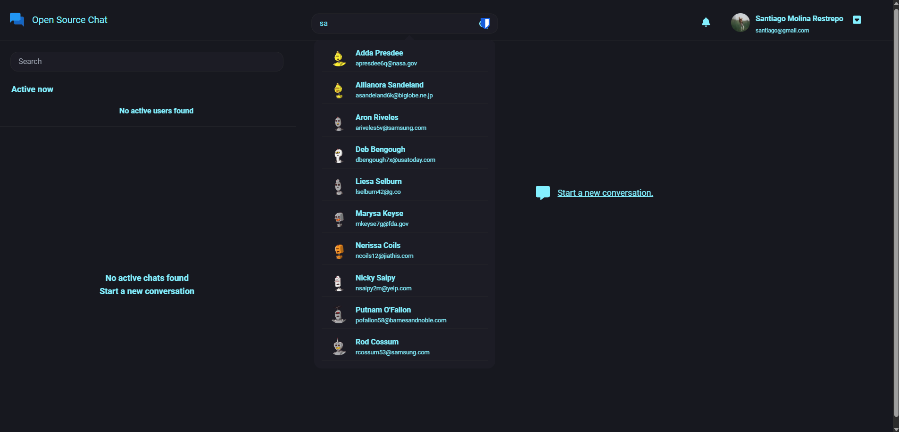
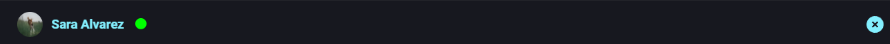

<<<<<<< HEAD
For deploying the project in a virtual machine using **SSL**:
1. Clone the project. 
2. Checkout web-docker-deployment branch. 
3. Modify nginx/default.conf file with your domain in "server_name".
4. Install docker. 
5. Execute docker-compose up --build -d.
6. Execute npx prisma db push inside app container to create database.
7. Execute npx prisma db seed inside container to feed the users to users table.
8. Execute "certbot certonly --webroot --webroot-path=/var/www/certbot -d yourdomain.com -d www.yourdomain.com" in certbot container. 
9. Uncomment ssl_certificate's and replace with your domain.
10. Uncomment listen 443 ssl;
11. Comment listen 80; 
12. Execute docker-compose down && docker-compose up --build -d
=======

### Descripción de la aplicación.

### Inicias sesión en: https://www.chatdemo.click/auth/login

### Si no tienes credenciales, puedes crear una cuenta aqui:  https://www.chatdemo.click/auth/register
### o usar las siguientes:

### correo: santiago@gmail.com  
### contraseña: 123456

### o la siguiente: 

### correo: sara@gmail.com
### contraseña: 123456

### Al registrarte te pedira que configures una foto de perfil sino lo deseas puedes omitir este paso y puedes ir a la página de inicio. 

### En la barra de búsqueda debes de buscar el usuario con el que deseas chatear. 

### Y puedes comenzar a chatear con este usuario. 

### Una vez le hallas mandado un mensaje, te quedara en la lista de usuarios en la parte izquierda. 

### Si el usuario se encuentra en linea, te aparece su foto en la lista de usuarios activos y un icono que indica que esta conectado 

### Al recibir una notificación de mensaje, te aparece un popup con la notificación

### Una vez que recibas el mensaje, te aparecera una lista de respuestas rápidas generadas con inteligencia artificial que puedes seleccionar.

### En la lista izquierda puedes bloquear el usuario o mutear sus notificaciones al seleccionar los tres puntos. 

### Tambien puedes editar tus datos personales, cambiar tu contraseña y desbloquear usuarios que tengas bloqueados. Para cambiar tu foto, haz click en la foto. 

### Si deseas restaurar tu contraseña, puedes hacerlo aqui: https://www.chatdemo.click/auth/forgotpassword
### Ingresas tu correo electronico y el sistema te enviara un link de restauración.

### El correo que te debe de llegar es similar a este:

### Clickeas el link del correo y te lleva a la siguiente pagina donde puedes reestablecer tu contraseña: 

>>>>>>> main
